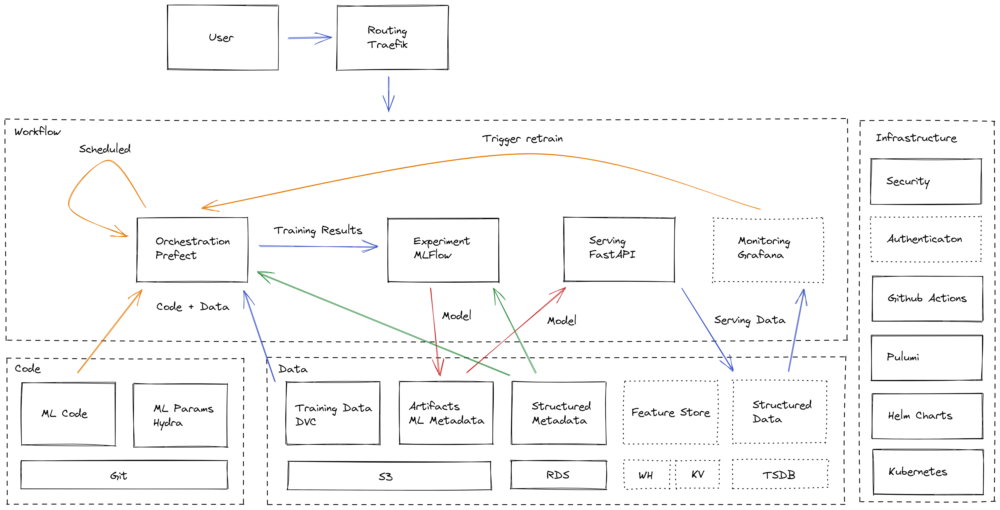

# Cloud ML Platform

Borrowed many codes from [this awesome repo](https://github.com/aporia-ai/mlplatform-workshop).

This repo contains example code for a (very basic) Cloud ML platform.

 * The **ml_pipeline** directory contains an example machine learning project for iris classification.
 * The **ml_infra** directory contains Pulumi code that spins up the shared infrastructure of the ML platform, such as Kubernetes, MLFlow, etc.

## Why?

As data science teams become more mature with models reaching actual production, the need for a proper infrastructure becomes crucial. Leading companies in the field with massive engineering teams like Uber, Netflix and Airbnb had created multiple solutions for their infrastructure and named the combination of them as “ML Platform”.

We hope this repo can help you get started with building your own ML platform ❤️

## Architecture 



### Based on the following projects:

* [FastAPI](https://fastapi.tiangolo.com/) - for model serving
* [MLFlow](https://www.mlflow.org/) - for experiment tracking
* [DVC](https://dvc.org/) - for data versioning
* [Pulumi](https://www.pulumi.com/) - Infrastructure as Code
* [GitHub Actions](https://github.com/features/actions) - for CI/CD
* [Traefik](https://traefik.io/) - API gateway
* [PDM](https://pdm.fming.dev/) - Python dependency management
* [Hydra](https://hydra.cc/) - for parameter management
* [Prefect](https://www.prefect.io/) - for workflow management

When building your own ML platform, do not take these tools for granted! [Check out alternatives](https://mlops.toys) and find the best tools that solve each one of your problems.

## What's missing from this?

Well... a lot actually. Here's a partial list:

* HTTPS & Authentication
* Data quality and governance
* Large scale data processing framework
* Feature store for offline and online scenarios
* Jupyter notebook support
* Advance workflow orchestration and scheduling
* Distributed model training support
* Model diagnostic and error analysis
* Model performance monitoring
* and probably much more!

We would love your help!

## Getting Started

The following steps are based on Windows development environment.

1. **Before You Begin**:

    Install `pulumi`, `node` and aws tools:
   
    ```powershell
    choco install pulumi
    choco install nodejs
    msiexec.exe /i https://awscli.amazonaws.com/AWSCLIV2.msi
    choco install -y aws-iam-authenticator
    choco install -y kubernetes-helm
    ```
    
    Install `pdm`:

    ```powershell
    (Invoke-WebRequest -Uri https://raw.githubusercontent.com/pdm-project/pdm/main/install-pdm.py -UseBasicParsing).Content | python -
    ```

2. **Bring Up Infra**:

    We use `pulumi` to setup the infrastructure.

    ```powershell
    $env:AWS_ACCESS_KEY_ID = "<YOUR_ACCESS_KEY_ID>"; $env:AWS_SECRET_ACCESS_KEY = "<YOUR_SECRET_ACCESS_KEY>"
    cd ml_infra
    npm install
    pulumi up
    ```
   
    If you encounter any errors, just fix the code and run `pulumi up` again.

    When it succeeded, export the kubeconfig:

    ```powershell
    pulumi stack output kubeconfig > ~\.kube\config
    ```
   
    Now we can check the k8s cluster and pods status by running command:

    ```powershell
    kubectl get no
    kubectl get po
    ```

3. **Prepare Python Environment**:

    We use `pdm` to manage the Python environment:

    ```powershell
    cd ml_pipeline
    pdm install
    ```

4. **Prepare Raw Data**:

    Put your raw data into the `data/raw` folder, and use `dvc` to manage them.
   
    ```powershell
    pdm run dvc --cd data add raw/iris.parquet
    pdm run dvc --cd data push
    # if you are in a git repo
    git add raw/iris.parquet.dvc
    ```

5. **Run Pipeline**:

    Modify the data processing, feature engineering, modeling and orchestration code. Once you are done, run the whole pipeline.
   
    ```powershell
    pdm run python pipeline.py
    ```

6. **View Experiments**:

    We can check the model training results and artifacts through MLFlow. Visit http://your_domain_name/mlflow .
   
7. **Use Prefect**:

    TODO
   
8. **Deploy Model**:

    We use `pulumi` to build image, push to remote repository and configure the serving service.
   
    ```powershell
    cd ml_pipeline/infra
    npm install
    pulumi up
    ```
   
    Now you can test your model through public API: http://your_domain_name/models/<model_name>/predict .

8. **CI/CD**:

    We provided Github actions config file in `ml_pipeline/.github` folder. Modify the workflow and push the `ml_pipeline` project to Github. The workflow will be automatically triggered.


You can also visit this [blog post](https://zhuanlan.zhihu.com/p/383528646) to read more details about this project.
